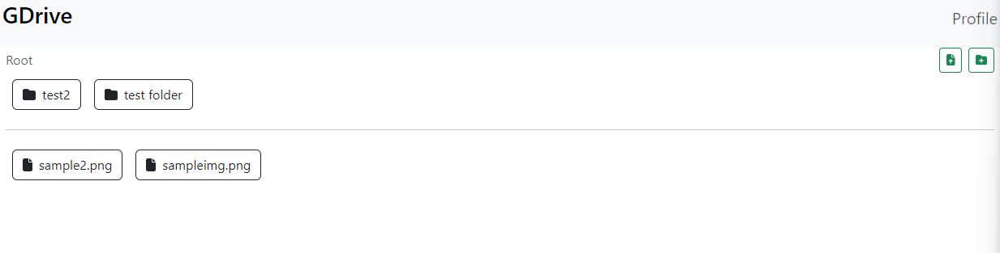

# GDrive Clone

GDrive Clone is a project aimed at replicating the functionality of Google Drive, providing users with a familiar interface for storing and accessing files. Built using modern web technologies such as React, Firebase, and Bootstrap, it ensures a responsive and scalable environment that can be accessed from various devices and platforms.
